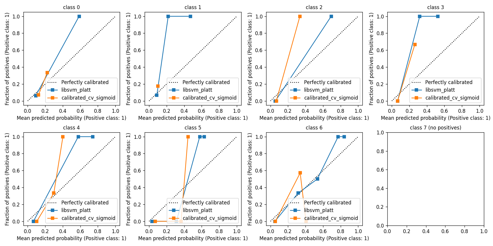

# v2 SVM Calibration Comparison Report -- Phase 9 Wave 1 (D-37/D-39)

**Generated:** 2026-05-26T17:53:31Z
**Hold-out:** 20 pinned gutenberg_ids (17 of 20 in-comparison; the rest were dropped from the v2 corpus by Phase 8.1's drop strategy).
**In-comparison ids:** `[103, 105, 1184, 120, 121, 1257, 144, 169, 175, 244, 2565, 284, 50133, 70652, 78, 83, 863]`

## Summary

Winner: **libsvm_platt** (Brier = 0.3459, lower wins).

## Brier scores (multiclass, range [0, 2], lower better)

| Method | Brier | Log-loss | Notes |
|--------|------:|---------:|-------|
| `SVC(probability=True)` libsvm Platt 5-fold CV | 0.3459 | 0.7921 | sklearn built-in |
| `CalibratedClassifierCV(method='sigmoid', cv=StratifiedKFold(5))` | 0.6041 | 1.2652 | LOOCV-equivalent for multiclass (sklearn rejects LOOCV here) |

**Tie-breaker rule** (CONTEXT.md §specifics): if `|Brier_a - Brier_b| < 1e-3`, default to `libsvm_platt`. Applied: **no** -- actual delta = 0.2583.

## Reliability diagrams



(One subplot per class x 2 methods overlay; 5 bins; 17 hold-out books.)

## Decision rationale

The winning method (libsvm_platt) was selected by the Brier-score comparison above. Per CONTEXT.md §specifics, the empirical winner stands without tie-break.

## Entropy distribution

Computed on the winning method's predict_proba over the in-comparison hold-out subset.

| Statistic | top1 - top2 | normalized_entropy |
|-----------|------------:|-------------------:|
| p25 | 0.2801 | 0.6199 |
| p50 | 0.4599 | 0.7032 |
| p75 | 0.5399 | 0.7738 |

- `n_fires_top1_top2_gap_lt_010`: 2 of 17
- `n_fires_norm_entropy_gt_07`: 9 of 17
- `n_fires_either` (DEPTH-07 badge fires at research defaults): 9 of 17
- `fire_rate_either`: 0.5294

## Entropy threshold decision

Per the Q4 confirm-or-adjust rule (09-RESEARCH.md), the operative thresholds for the DEPTH-07 entropy/uncertainty badge are committed here. Plan 09-03 reads these values verbatim into `backend/pipeline/explain.py` constants.

```yaml
decision: tighten
operative_gap_threshold: 0.2801      # consumed by ENTROPY_BADGE_DEFAULT_TOP1_TOP2_GAP in plan 09-03
operative_entropy_threshold: 0.7738  # consumed by ENTROPY_BADGE_DEFAULT_NORMALIZED_ENTROPY in plan 09-03
default_gap_threshold: 0.1000
default_entropy_threshold: 0.7000
fire_rate_at_defaults: 0.5294
```

**Rationale:** Fires on 9/17 (53%) at defaults -- too noisy for the v2 SVM. Tightening to 25th-percentile gap (0.2801) and 75th-percentile normalized entropy (0.7738).

## Reproducibility

```bash
python scripts/calibrate.py --window 15 --k-clusters 200 --alpha 0.7
```

---

*Author-leakage caveat (D-51, voice consistent with `results/v2_validation_report.md`):* the v2 SVM's per-author smoke test failed in Phase 8 (mean-author-gap 36.96pp), so all Brier and reliability numbers reported here are best treated as upper bounds. The DEPTH-07 entropy badge surfaces per-prediction uncertainty so users can judge confidence in context. See `results/v2_validation_report.md` for the full disclosure surface.
